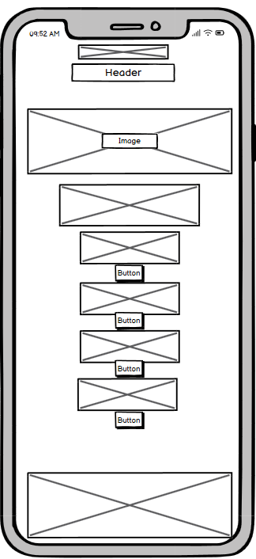

# Muay Thai Club Website

Welcome to the Muay Thai Club website! This project is a web application build with Django that provides information about the Muay Thai club, including activities, training sessions, events, and much more. The website allows users to register, login, and interact with the club's content.

Access the site here <a href="https://muay-thai-club-website-a215eeee688f.herokuapp.com/">Muay Thai Club Website</a>


## Wireframes

 

## Table of Contents
- [Features](#features)
- [Design](#design)
- [Technologies Used](#technologies-used)
- [Usage](#usage)
- [Deployment on Heroku](#deployment-on-heroku)
- [Local Deployment](#local-deployment)
- [Known Issues and Future Improvements](#known-issues-and-future-improvements)
- [Credits](#credits)
- [License](#license)

## Features

- User Registration, Login, and Logout using Django-allauth
- Home page with an image carousel and welcome text
- Contact form for questions from users saved in the database
- Saving images using Cloudinary
- Activities with categories created from the admin dashboard
- Admin interface for managing content with rich text editing capabilities provided by django-summernote
- Book or cancel booking for users

### CRUD Functionality
Our Muay Thai Club website includes comprehensive CRUD (Create, Read, Update, Delete) functionality for managing training sessions. These operations are integrated both into the frontend and admin interface, ensuring that only authenticated and authorized users can manage the content. This ensures both security and ease of management.

**Create**
- Admins can create new training sessions through a user-friendly form available in the admin interface. This form includes fields for the session title, description, instructor, categories, featured image, date, and time.

**Read**
- All training sessions are listed on the main page, with pagination to improve user experience. Users can filter sessions by category, and each session detail page provides complete information about the session, including booking options for authenticated users.

**Update**
- Admins can update existing training sessions through the admin interface. Each session listed includes an "Edit" button that directs the admin to an edit form pre-filled with the current session details. This form allows the admin to make necessary changes and save them.

**Delete**
- Admins can delete training sessions directly from the list of sessions or from the session detail page. Each delete action is confirmed with a prompt to prevent accidental deletions.

## Design

### Colour Scheme

The color scheme of the Muay Thai Club website was carefully chosen to reflect the energetic and bold spirit of the sport. The design balances vibrant and neutral tones to create an engaging and professional atmosphere.

**Primary Colors**
- #a11300 (Orange-Red): This strong, bold color symbolizes energy, passion, and action, fitting for a Muay Thai club. It is used for buttons, headings and call-to-action elements.
- #4A4A4F (Dark-Gray): Used for header and text, this neutral tone ensures readability while maintaining a sleek, modern look.

**Secondary Colors:**
- #FFFFFF (White): White is used for backgrounds and to create negative space, helping to maintain a clean and minimalistic design.
- #445261 (Light-Gray): A soft background color used for post links, adding a subtle contrast without distracting from the main content.
Accent Colors:
- #ffc107 (Yellow): Used for buttons in the CRUD for admins.
- #dc3545 (Light-Red): Used for buttons in the CRUD for admins.

- #007BFF (Blue): This color is used sparingly for highlights and links, giving a vibrant touch that contrasts well with the primary color palette.
- #28A745 (Green): Used to indicate success messages (e.g., successful booking), adding positive reinforcement for user actions.
Typography

- The typography for the website complements its modern and dynamic design. Two fonts were selected to enhance readability and convey the club's strong, athletic brand.

**Primary Font**
- **Roboto:** Is the main color of the site, used for body text elements. It's a sans-serif font known for its clean and professional appearance, making it suitable for titles and key messaging.
Secondary Font:
- **Bebas Neue:** is used for headings and link text. This sans-serif font offers excellent readability on digital screens, ensuring that the content remains easy to consume even in longer paragraphs.

**Font Sizes:**
- **Headings:** (1.4rem) Ranges from h1 (32px) for main titles to h6 (16px) for subheadings, ensuring a clear hierarchy across the site.
- **Body Text:** The primary body text is set at 16px, providing comfortable readability across different devices.
- **Buttons/Call to Action:** Buttons use slightly larger, bold text to draw attention and encourage user interaction.
- The combination of the chosen color scheme and typography creates a user-friendly, aesthetically pleasing website that reflects the active and empowering spirit of Muay Thai.

## Testing

### Manual Testing

#### Home Page
- **Test:** Navigated to the home page.
  - **Result:** The page loads successfully with all images, text, and links displayed correctly.
- **Test:** Clicked on various navigation links.
  - **Result:** Each link navigates to the correct page without errors.

#### Contact Form
- **Test:** Filled out and submitted the contact form.
  - **Result:** Form submission was successful, saved in the database, and a confirmation message was displayed.
- **Test:** Submitted the form with invalid data (e.g., missing required fields, invalid email format).
  - **Result:** Appropriate error messages were displayed for each invalid input.

#### Training Sessions
- **Test:** Viewed the list of training sessions.
  - **Result:** All sessions were displayed correctly, including images, titles, and excerpts.
- **Test:** Clicked on a session to view details.
  - **Result:** The session detail page loads correctly with all relevant information.
- **Test:** Created a new training session (as an admin).
  - **Result:** The new session was successfully created and displayed in the list.
- **Test:** Edited an existing training session (as an admin).
  - **Result:** The session was successfully updated.
- **Test:** Deleted a training session (as an admin).
  - **Result:** The session was successfully deleted after confirmation.
- **Test:** booked a training session (as a user).
  - **Result:** The session was successfully booked after confirmation.
- **Test:** Canceled a training session (as a user).
  - **Result:** The session was successfully canceled after confirmation.

#### Error Pages
- **Test:** Navigated to a non-existent URL.
  - **Result:** The custom 404 error page was displayed.
- **Test:** Induced a server error to test the 500 error page.
  - **Result:** The custom 500 error page was displayed.

### Browser Testing
- **Browsers Tested:**
  - Google Chrome
  - Mozilla Firefox
  - Microsoft Edge
- **Test:** Viewed the website in different browsers.
  - **Result:** The website displays and functions correctly across all tested browsers.

### Responsive Design Testing
- **Test:** Viewed the website on different devices (desktop, tablet, mobile).
  - **Result:** The website is responsive and displays correctly on all device sizes.

### Accessibility Testing
- **Test:** Used tools like Lighthouse and WAVE to test accessibility.
  - **Result:** The website meets accessibility standards, with scores indicating good compliance.

### Performance Testing
- **Test:** Used tools like Google PageSpeed Insights to test page load times and performance.
  - **Result:** The website performs well with minimal load times and good performance scores.

### Deployment Testing
- **Test:** Deployed the application to Heroku and tested all functionalities.
  - **Result:** The application works as expected in the production environment without any deployment issues.

## Technologies Used

**Frontend:**
- **HTML:** Used for structuring the web pages.
- **CSS:** Used for styling the web pages.
- **Bootstrap:** A CSS framework that helps to create responsive and mobile-first web pages. It provides pre-designed components and utilities.

**Backend:**
- **Python:** The core programming language used for developing the backend.
- **Django:** A high-level Python web framework that encourages rapid development and clean, pragmatic design.
- **Django-allauth:** Used for handling user authentication, registration, and account management.
- **Django-summernote:** An integration of Summernote (a JavaScript library) with Django, used for rich text editing.
- **Django-crispy-forms:** Used to control the rendering behavior of Django forms. Specifically, it provides integration with the Bootstrap CSS framework.
- **Contact Form:** Implemented to allow users to send messages which are saved in the database for further processing or retrieval.
- **Static Files:** Managed with Django’s static file handling capabilities and deployed with Heroku to serve CSS, JavaScript, and image files efficiently.

**Database:**
- **SQLite:** The default database for Django development. It’s lightweight and easy to set up, making it ideal for development and testing purposes.
- **PostgreSQL:** Mention that while SQLite is used for development, the application is ready to be configured for PostgreSQL for production environments. PostgreSQL is a powerful, open-source object-relational database system with a strong reputation for reliability, feature robustness, and performance.
- **psycopg2:** The PostgreSQL adapter for Python, allowing your Django application to interact with a PostgreSQL database.

**Deployment:**
- **Heroku:** A cloud platform that lets you build, run, and operate applications entirely in the cloud.
- **Gunicorn:** A Python WSGI HTTP Server for UNIX, which is used to run your Django application on Heroku.
- **Whitenoise:** A library that enables your Django application to serve its own static files, simplifying the process of deploying static assets.
- **dj-database-url:** A utility to parse database URLs in Django settings, facilitating seamless database configuration in Heroku’s environment.
- **Cloudinary:** Used for managing and delivering media files (images, videos, etc.). The django-cloudinary-storage package integrates Cloudinary with Django.

**Packages and Libraries:**
- **asgiref:** ASGI (Asynchronous Server Gateway Interface) reference implementation, which provides a standard for asynchronous web servers and applications in Python.
- **bleach:** A whitelist-based HTML sanitizing library that can be used to clean user input in forms.
- **certifi:** Provides Mozilla's CA Bundle in Python, crucial for SSL verification.
- **charset-normalizer:** A library for character encoding auto-detection.
- **idna:** Support for Internationalized Domain Names in Applications (IDNA).
- **requests:** A simple, yet elegant HTTP library for Python, used for making HTTP requests.
- **six:** A Python 2 and 3 compatibility library.
- **sqlparse:** A non-validating SQL parser for Python, used by Django for formatting SQL queries.
- **tzdata:** Timezone database for handling time zone conversions.
- **urllib3:** A powerful, user-friendly HTTP client for Python.
- **webencodings:** Encoding utilities for web applications.
- **packaging:** Library for dealing with Python packages.
- **gunicorn:** A Python WSGI HTTP Server for UNIX, used to run the Django application on Heroku.

## Additional Information
**Other Tools and Configurations:**
- **Git:** Version control system used to track changes in the source code.
- **GitHub:** Hosting service for version control using Git, used for project collaboration and deployment.
- **Virtual Environment (venv):** Used to create isolated Python environments for managing dependencies.

## Usage
- **Register a new user:** Navigate to the signup page and fill out the registration form.
- **Login:** Use the login page to access your account.
- **Booking a Training Session**
- 1 Navigate to the list of training sessions.
- 2 Select a session to view its details.
- 3 Click on the "Book Now" button to create a booking.
- **Admin Interface:** Access the admin interface at /admin to manage content. Use the superuser credentials created during installation.

## Deployment on Heroku
To deploy the Muay Thai Club website on Heroku, follow these steps:

### Prerequisites
- Ensure you have a Heroku account. Sign up at Heroku if you don't have one.
- Prerequisites
- Python 3.x
- Django
- Cloudinary account (for image storage)

**Steps to Deploy**
- Login to Heroku:
- Create a new Heroku app:
- Add a PostgreSQL database to your app:

1. **Set up environment variables:**
- In your local project directory, create a .env file and add your environment variables (e.g., Database URL, Django secret key, Cloudinary URL). You can also need to set them directly in Heroku.

```console
os.environ.setdefault("DATABASE_URL", "your-database-url")
os.environ.setdefault("DJANGO_SECRET_KEY", "your-secret-key")
os.environ.setdefault("CLOUDINARY_URL", "your-cloudinary-url")
```

2. **Prepare your project for Heroku deployment:**
- Create a Procfile in the root of your project:

```console
web: gunicorn your_project_name.wsgi:application
```

- Create requirements.txt:

```console
pip freeze > requirements.txt
```

- Update settings.py to use PostgreSQL database URL set in env.py:

```console
DATABASES = {
    'default': dj_database_url.parse(os.environ.get("DATABASE_URL"))
}
```

- Update settings.py with trusted origins

```console
CSRF_TRUSTED_ORIGINS = [
    "https://*.herokuapp.com",
]
```

- Add static files configuration in settings.py:

```console
STATIC_URL = 'static/'
STATICFILES_DIRS = [os.path.join(BASE_DIR, 'static'), ]
STATIC_ROOT = os.path.join(BASE_DIR, 'staticfiles')
```

- Install gunicorn and dj-database-url:

```console
pip3 install gunicorn dj-database-url
```

3. **Initialize a Git repository if you haven't already:**

```console
git init
```

- Commit your changes:

```console
git add .
git commit -m "Prepare for Heroku deployment"
```

- In Heroku dashboard where you created your new app in the deploy tab conntect your github and then deploy your branch
- Open your deployed app in the browser:


## Local Deployment

1. **Clone the repository:**

```console
git clone https://github.com/yourusername/muay-thai-club-website.git
cd muay-thai-club-website
```

2. **Install the Required Dependencies**

```console
pip install -r requirements.txt
```

3. **Set up the database:**

```console
python manage.py migrate
```

4. **Create a superuser:**

```console
python manage.py createsuperuser
```

5. **Run the development server:**

```console
python manage.py runserver
```

6. **Navigate to the project in your browser:**

```console
http://127.0.0.1:8000/
```

## Known Issues and Future Improvements

**Known Issues:**
- Describe any known issues here.

**Future Improvements:**
- Testing application with Django testing
- Improving code functionality in different areas
- Restructure homepage view so it is automated
- Activities to categories.objects.all

## Credits

**Content**
  - Some of the text for the README.md file were taken from <a href="https://chat.openai.com/">ChatGPT</a>
  - Contact form requests on contact page taken from the CI <a href="https://github.com/Code-Institute-Solutions/blog/tree/main/13_collaboration_form/01_create_the_form/about">Django Blog</a>

## License
- This project is licensed under the MIT License - see the LICENSE file for details.
